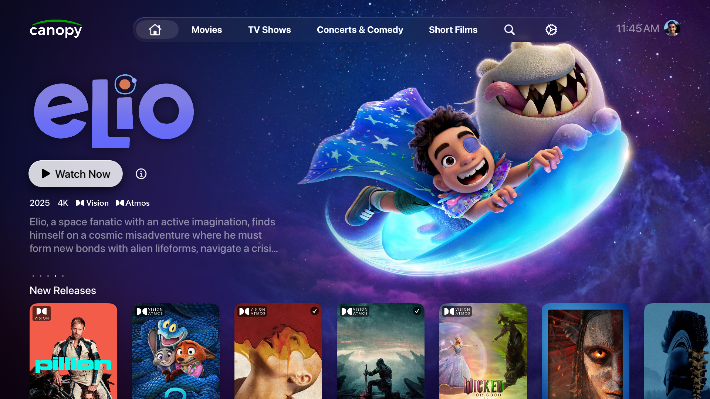
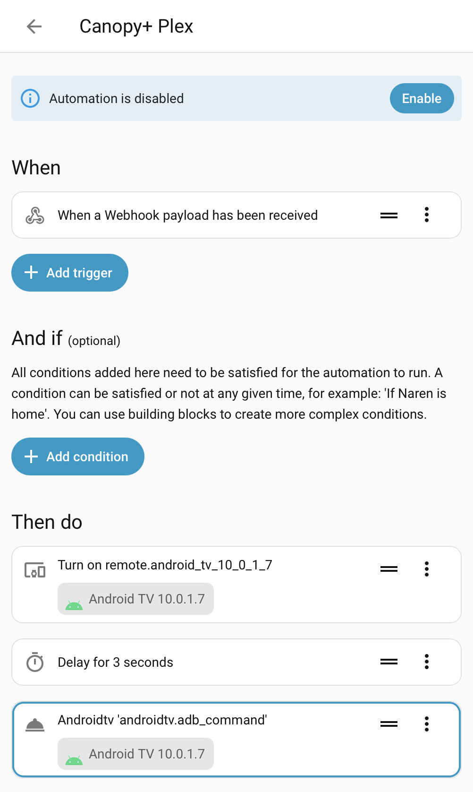

<h1>
  
  Canopy+
</h1>

A Plex frontend for tvOS, human-written* in SwiftUI. Meant for integrating with CoreELEC (Ugoos AM6B+) or Nvidia Shield.

<p align="center">
  
</p>

## Download

<a href='https://apps.apple.com/us/app/canopy/id6742864890'></a>


## Setup Instructions

### Login
- Login with the same Plex account that you use to sign in on your Apple TV. This is required for deeplinking to function.
- Supports standard accounts and managed Home users, along with PIN enforcement.

### External Player Integration
- Home Assistant (HASS) HIGHLY recommended. This will allow you to tweak things based on your own setup.

#### Nvidia Shield
- This one's by far the easiest. 
- HASS → Install Android Debug Bridge
- HASS → Settings → Automations → Create Automation From Scratch. 
- Add trigger → Webhook (can customize this if you'd like)
- Under "Then do", wake up your shield, Delay for 3 seconds, then run this ADB command: 
```
am start --ez "android.intent.extra.START_PLAYBACK" '{{
    trigger.json.startPlaying }}' -a android.intent.action.VIEW
    'plex://server://{{ trigger.json.serverId
    }}/com.plexapp.plugins.library/library/metadata/{{ trigger.json.ratingKey
    }}'
```
- Get the full webhook URL. Generally will be `http://[HASS_HOST]:[HASS_PORT]/api/webhook/[WEBHOOK_ID]`
- Copy the URL on your iPhone, open Canopy+ → Settings → External Player → and paste the URL into the URL field.
- Note: Since the shield has a working CEC implementation, input switching should be handled automatically by your AVR/TV/Soundbar


#### CoreELEC (Ugoos AM6B+ or similar)
- This one is slightly more complicated, as Kodi deeplinking can be a bit tricky.
- Install PKC on CoreELEC. PM4K users, you can continue to use PM4K (although there will be no need for it, presuming you keep your browsing to the Apple TV).
- PKC is required because it allows Kodi to start playback natively, including Plex sessions and tracking watched status.
- PKC quirks: make sure all of your TV shows are set to "show" their seasons. Any TV show set to "hide seasons" will not sync properly. This is a longtime bug with the Plex API, and PKC has been unable to find a workaround.
- PKC quirks, part 2: PKC allows for starting playback via "addon paths", which allows you to start playback with just a ratingKey. However, in this mode, it will not trigger a Plex session and will not sync your watched status.
- So, we have to do a little Kodi db hacking.
- In this repo, you'll find three files in `/coreelec`, copy these to your CoreELEC box: 
	- Copy `process_media.sh` to `/storage/scripts/process_media.sh`
	- Copy `plex_endpoint.py` to `/storage/scripts/plex_endpoint.py`
	- Copy `plex-endpoint.service` to `/storage/.config/system.d/plex-endpoint.service`
- Register and start the service:
```
systemctl daemon-reload
systemctl enable plex-endpoint.service
systemctl start plex-endpoint.service
systemctl status plex-endpoint.service
```
- What this does is run a tiny Python server that looks up Kodi's media ID from a Plex ratingKey and media type (Kodi has separate DBs for movies and TV episodes)
    - You'll have to modify the Python script to include your Kodi HTTP control credentials, and you may want to make other changes depending on your setup
- A simple GET to `http://COREELEC_IP:8082/?rating_key=RATING_KEY&media_type=[movie|episode]` will trigger playback!
- Now you can set up a HASS webhook just like above in the Shield instructions, but you can do other things in the automation if you'd like. For example, I have my Denon AVR integrated into HASS so I have it switch inputs and audio modes, along with adjusting lights after sundown.


### AI Disclosure
- Canopy+ is almost entirely human-coded with one major exception: the schema, networking, and data models for Plex's Discover and Metadata endpoints.
- All UI and app logic is human-written.
- Integrations and scripts in this repo were written with significant help from AI. I'm new to homelab stuff and am primarily an iOS engineer.